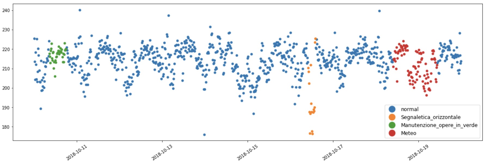
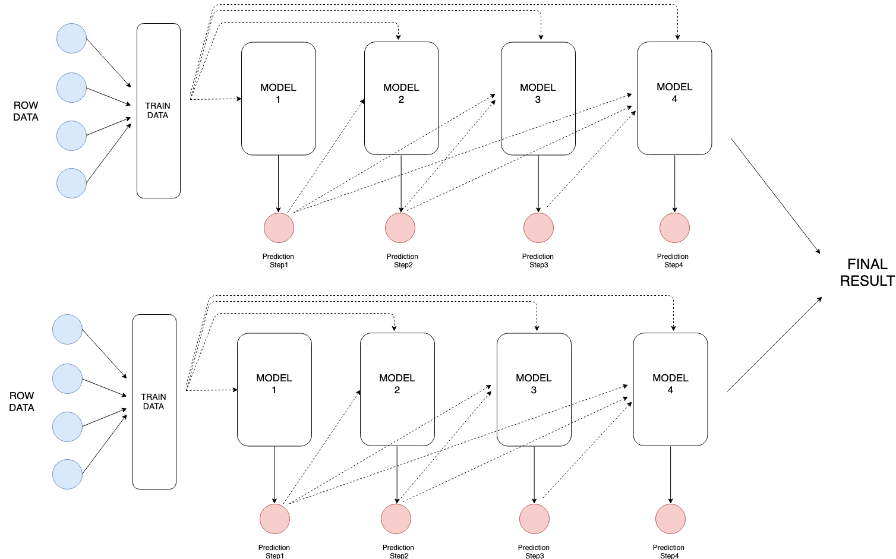

# Data Mining project 2019
<p align="center">
  
</p>
<p align="center">
    
</p>

## Overview
This is the code for the Data Mining project of the course in 2019 at Politecnico di Milano.

The goal is to predict traffic average speeds in specific times and points of Italian roads.

**We classified first** with a mean absolute error of **8.5 Km/h** (see the evaluation section for more about the metric).


## Description
Traffic conditions are measured by **sensors** installed in the roads. They are identified by the *road* in which they are and the *km*. They provide measurements at interval of 15 minutes, in particular about:
* the average speed
* the min speed
* the max speed
* the speed standard deviation
* the number of vehicles

During the day, several **events** may happen (e.g. accidents, roadworks, ...). Data tell us useful info about them:
* type
* location
* duration
* details

In addition, we have information also about the **weather**, *hourly* measured by a set of weather stations. We have:
* min temperature
* max temperature
* nearest sensors

**The goal is to predict the average speeds of each target sensor for the 4 quarters of hour immediately after the beginning of an event involving that sensor.**

<p align="center">
    
</p>

## Dataset
You can download the dataset here: [dataset.zip](https://mega.nz/#!x6IREALa).

Extract the archive in: `resources/dataset/originals`.

You will get the following csv files:
* speeds.csv.gz: contains the speeds measurements
* events.csv.gz: contains data about the events
* weather.csv.gz: contains data about the weather
* distances.csv.gz: contains the nearest weather stations near each sensor. The format of the file is: 
````
road, km | weather_station_id_0, distance_0, weather_station_id_1, distance_1, ...
````
* sensors.csv.gz: contains some info about the roads

The files for *speeds, events and weather* are splitted in 3 files:
* {file}_train: the file is used as training set
* {file}_test: the file is used as validation set
* {file}_2019: the file is used as test set

See the [assignment document](assignment.pdf) for additional details.

## Evaluation
The evaluation metric is the [**Mean Absolute Error (MAE)**](https://en.wikipedia.org/wiki/Mean_absolute_error) between the real average speeds and the predicted ones.

## Our solution
The task is a multi-regression problem, since we have to predict 4 real values. We built an ensemble of two gradient-boosted trees models, **Catboost** and **LightGBM**, each of them is trained in the following way: the prediction of a model is passed to the next model as a new feature. This is called and implemented in sklearn as [multioutput regressor-chain](https://scikit-learn.org/stable/modules/generated/sklearn.multioutput.RegressorChain.html). The models we used can handle missing values, but the sklearn implementation of the regressor-chain does not allow the presence of them in the dataset. So, we had to modify the code of sklearn to allow nan values.
<p align="center">
    
</p>

Check the [project presentation](Documenti/slides.pptx) for further details on the models and results.